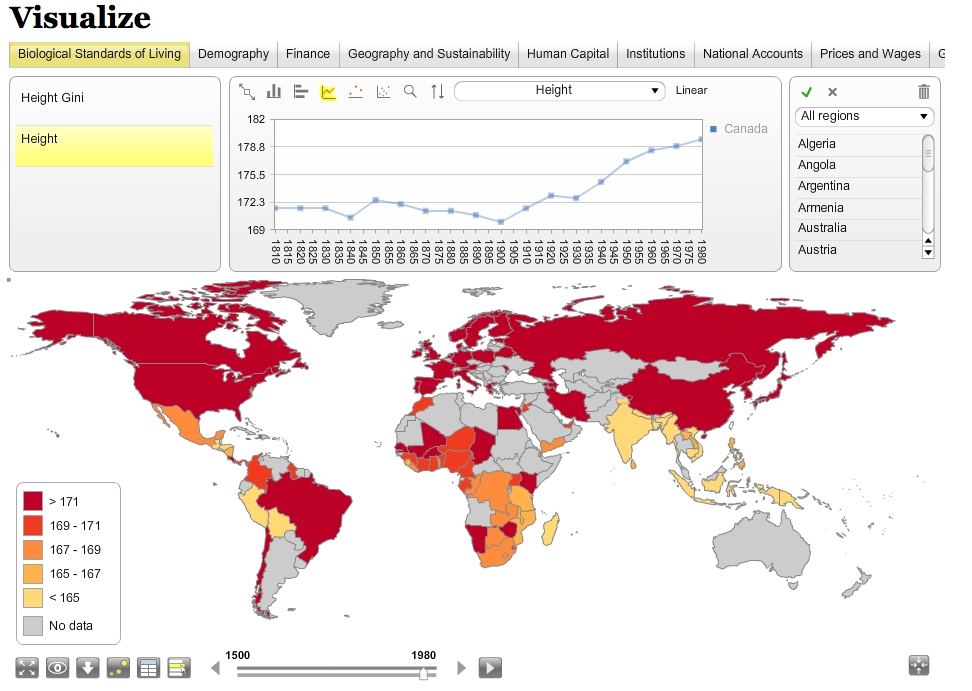
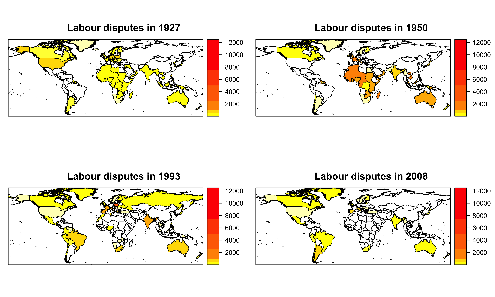

# Het nut van een GIS
Geografische Informatie Systemen (GIS) om data te:

- presenteren
- analyseren
- controleren
- beheren

# CLIO-INFRA en Statplanet

# CLIO-INFRA en Statplanet

Veranderingen over de tijd, maar geen historische grenzen

# Waarom historisch accurate grenzen?
- inzicht in context (bv. Algerije als Frans grondgrebied)
- beschrijvende analyses (bv. bevolkingsdichtheid)
- verklarende analyses: cluster correctie
  - spatiële regressie
  - multi-level regressie

# Historische GIS in Nederland
## HISGIS.NL
- zeer gedetailleerd (perceel-niveau)
- voor enkele jaren

## NLGIS.NL
- gedetailleerd (gemeente-niveau)
- jaarlijkse kaarten voor (1812-1997)

# NLGIS: een verkenning

Mogelijkheden van [NLGIS](https://nlgis.nl)

## Voor het brede publiek
- Visualiseren data op historisch accurate gemeentegrenzen
- Visualiseren eigen datasets

## Voor data-scientists
- Toegang tot HDNG data via API
- Toegang tot kaarten via API

## Voor onderzoekers
- R-package
  - makkelijke toegang tot API
  - makkelijk interactief kaarten maken
  - integratie met geavanceerde analyses in R

# Stakingen in kaarten: een uitbreiding 
- Data: Stakingen vanaf de 14e eeuw
- Kaarten: 4 jaren op wereldniveau

# Stakingen in kaarten: een uitbreiding 

# Clariah: historische gis infra-structuur
- unieke identificatie van plaats en tijd
- databases geordend op basis van deze identificatie
- visualisatie op historisch accurate kaarten
- implementatie van eenvoudige analyses

# Contact
## Richard L. Zijdeman
richard.zijdeman@iisg.nl

